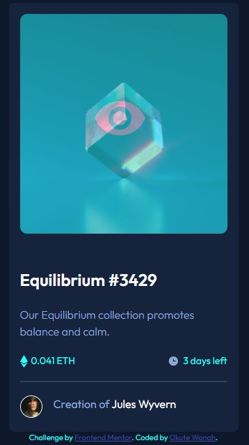

# Frontend Mentor - NFT preview card component solution

This is a solution to the [NFT preview card component challenge on Frontend Mentor](https://www.frontendmentor.io/challenges/nft-preview-card-component-SbdUL_w0U). Frontend Mentor challenges help you improve your coding skills by building realistic projects. 

## Table of contents

- [Overview](#overview)
  - [The challenge](#the-challenge)
  - [Screenshot](#screenshot)
  - [Links](#links)
- [My process](#my-process)
  - [Built with](#built-with)
  - [Useful resources](#useful-resources)
- [Author](#author)

## Overview

### The challenge

Users should be able to:

- View the optimal layout depending on their device's screen size
- See hover states for interactive elements

### Screenshot

### Links

- Solution URL: [Add solution URL here](https://github.com/okutewonah/fm-nft-preview-card/)
- Live Site URL: [Add live site URL here](https://okutewonah.github.io/fm-nft-preview-card/)

## My process

### Built with

- Semantic HTML5 markup
- CSS custom properties
- Flexbox
- CSS Grid
- Mobile-first workflow

### Useful resources

- [The CSS Reset](https://www.joshwcomeau.com/css/custom-css-reset/#the-css-reset) - Made CSS reset easy for me.

## Author

- Frontend Mentor - [@okutewonah](https://www.frontendmentor.io/profile/okutewonah)
- Github - [okutewonah](https://github.com/okutewonah)
